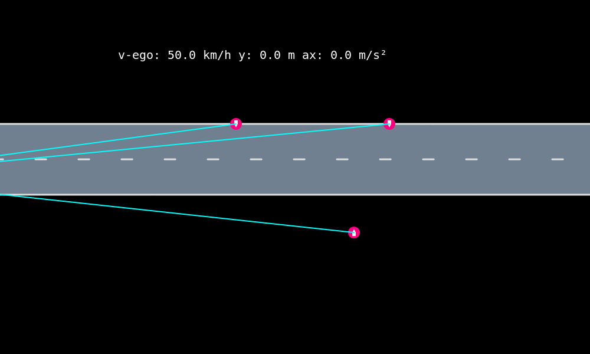
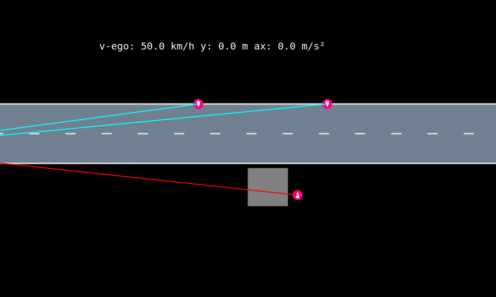
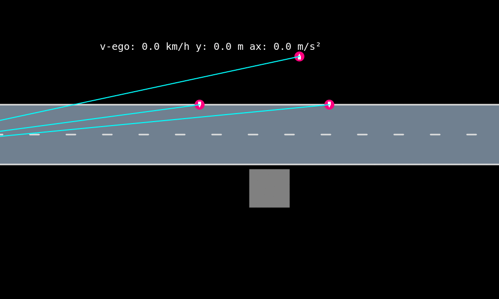

# PedestrianAvoidancePOMDP

contact: Markus Schratter, [m.schratter@gmx.at](m.schratter@gmx.at) Maxime Bouton, [boutonm@stanford.edu](boutonm@stanford.edu).

This code is associated with the following publication:

M. Schratter, M. Bouton, M. J. Kochenderfer, D. Watzenig, "Pedestrian Collision Avoidance System for Scenarios with Occlusions," in *IEEE Intelligent Vehicle Symposium*, 2019. [ArXiv](https://arxiv.org/abs/1904.11566).


# Description
  
POMDP planner in combination with an Autonomous Emergency Braking (AEB) system.

- POMDP planner: Pedestrian collision avoidance system to handle scenarios with pedestrians on the road and situations with a poor visibility, based on obstructions on the side of the road.  
- AEB system: Intervenes only in unavoidable collisions.

See the [paper](https://arxiv.org/abs/1904.11566) for a more detailed description.

 
  
## Getting started
### Installation / Dependencies

```julia 
using Pkg 
Pkg.add("POMDPs")
using POMDPs
POMDPs.add_registry() # add JuliaPOMDP registry 
Pkg.Registry.add(RegistrySpec(url="https://github.com/sisl/Registry")) # add sisl registry 
Pkg.add("PedestrianAvoidancePOMDP") # install the package and its dependencies
```

### Folder structure
- `src`: Implementation of the Pedestrian Avoidance System.
- `docs`: With the jupyther notebooks `docs/PedestrianAvoidanceSystem_One_scenario.ipynb` and `docs/PedestrianAvoidanceSystem_Evaluation_scenarios.ipynb` different implementations of the Pedestrian Avoidance System can be tested. With the notebook `docs/evaluation/plot_results.ipynb` results from different scenarios can be generated and visualized.  Generated videos from selected scenarios can be found in the folder `docs/videos`. 
- `policy`: Srcipt and jupyther notebook to train the POMDP policy.
- `results`: The results of the evaluation of the EuroNCAP scenarios are stored for different parameters for the POMDP policy. With the `Evaluation_Results.ipynb` the results can be evaluated. Generated diagrams are stored for different policies in this folder.


## Code to run

Run `docs/PedestrianAvoidanceSystem_One_scenario.ipynb` to test one scenario, different implementations of the system can be evaluated.

Run `docs/PedestrianAvoidanceSystem_Evaluation_scenarios.ipynb` to test all EuroNCAP scenarios for a defined POMDP policy.

Run `policy/Policy_Server_SparseValueIterationSolver.ipynb` to train a policy for the POMDP.

With the script  `src/longitudinal_script.sh` different POMDP policies can be trained and evaluated with the EuroNCAP scenarios, afterwards the results are stored in the folder `results`.


## Example scenarios
### CPAN25 50km/h, POMDP planner
Following animation shows a scenario with no obstruction and a crossing pedestrian from the right side. The pedestrian avoidance system (POMDP planner) reduces the velocity and accelerates when the pedestrian has passed the vehicle.



  
### CPCN 50km/h, POMDP planner
The obstruction on the right side covers the crossing pedestrian. In this case the pedestrian is for the system late visible and a collision is unavoidable. With a higher speed reduction based on the obstruction the collision would be avoidable.




### CPCN 50km/h, POMDP planner + AEB
Here additional to the POMDP planner the AEB system is active. Due to the AEB system (higher deceleration) the collision is avoidable and the ego vehicle does not pass the obstruction very slow.


### CPCN 50km/h with no crossing pedestrian, POMDP planner + AEB
At this scenario no pedestrian crosses the road. The ego vehicle reduces the velocity based on the poor visibility and a possible appearing pedestrian behind the obstruction. After the obstruction the ego vehicle accelerates to maintain the desired velocity of 50km/h.



  

## Reference
An explanation of the implementation can be found [paper](https://arxiv.org/abs/1904.11566), there is a detailed description how the system design looks like and results of the evaluation are shown. You may cite the IV paper if this code is helpful to you.
